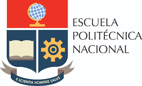

## CLASE 1 : **INTRODUCCIÓN A LA MATERIA** 
__________________

**FECHA** : 7 NOVIEMBRE DEL 2022

**NOMBRE**: DAVID DUQUE 

### CONTENIDO DE MATERIA 
--- 

    1. INTRDUCCIÓN A LA PROGRAMACIÓN.
    2. PROGRAMACIÓN PROCEDIMIENTO Y ESTRUCTURAL. 
    3. AARRAYS Y ESTRUCTURAS.
    4. ARCHIVOS.
    5. FUNCIONES Y MÓDULOS, LISTAS Y PILAS.

----

### NORMATIVA

* Evitar llegar tarde a clases.

* No hablar en el celular en clase, mantener en modo de silencio

* Evitar comer alimentos en clase.

* No distraerse en la computadora en actividades ajenas a la clase.
* No entregar tareas, deberes, laboratorios, ni proyectos atrasados.
* Se tomará en cuenta la participación en clase.  **Subir las tareas a la plataforma virtual (o por correo)**.
* Pruebas teóricas en plataforma virtual (o escritas).
* Se tomará en cuenta la participación de eventos académicos que organice la Facultad de Sistemas.

---

### CÓDIGO DE ÉTICA EPN 
____

"La tradición y el prestigio de la Politécnica exige un comportamiento de sus miembros en el encuadre mutuo, la honestidad, el apego a la verdad y el compromiso con la institución. Con tal antecedente, el presidente Código de Ética define la norma de conducta de los miembros de la Escuela Politécnica Nacional."

____

### Respeto hacia sí mismo y hacia los demás
___

* Fomentar la solidaridad entre los mienmbros de la cominidad

* Comportarse de manera que afrime la autoestima y contribuya al prestigio institucional, que sea ejemplo y referente para los demás
* Respetar a los demás y en particular la hona ajena y rechazar todo tipo de acusación o denuncias infundadas
* Respetar el pensamiento, la visión y los criterios ajenos.
* Excluir toda forma de violencia y actitudes discriminatorias
* Apoyar un ambiente pluralista y actitudes discriminatorias.
* Convertir la puntualidad en norma de conducta.
* Eviar el consumo de bebidas alcohólicas, sustancias psicotrópicas o estupefacientes.

