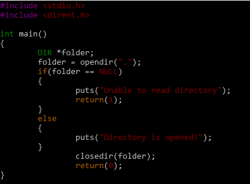
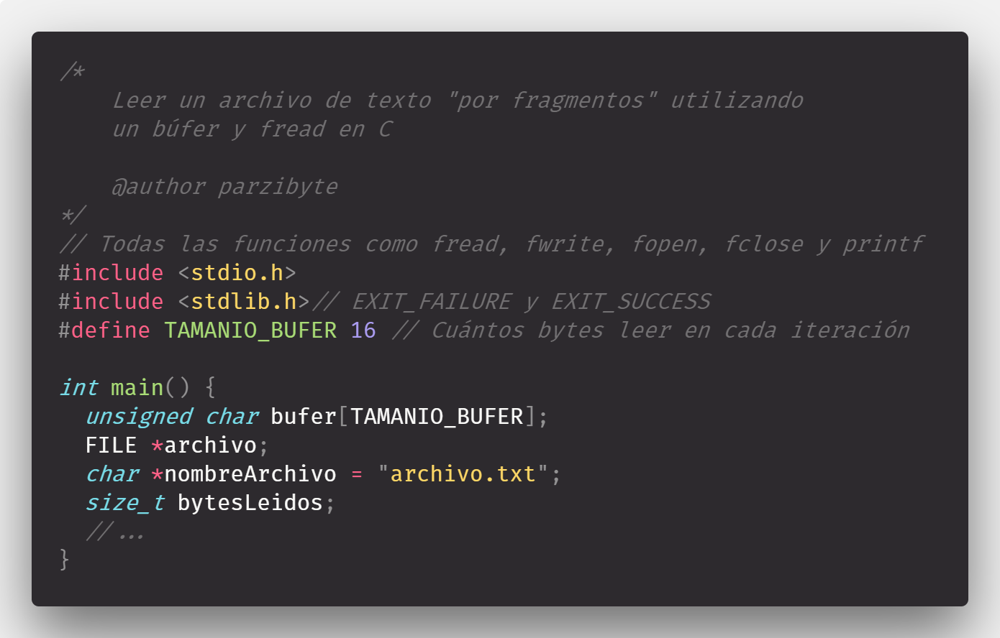

## CLASE 14: RESUMEN DE TEORÍA 
___
**FECHA** : 14 DE DICIEMBRE DEL 2022
___
### DIRECTIVAS DEL PRECOMPILADOR 
>Si el nombre del fichero va entre <...> se busca en el directorio include del sistema (/usr/include).



>Por ejemplo #include <stdio.h> hace que el fichero /usr/include/stdio.h se incluya en ese punto para ser compilado con nuestro fichero fuente

>El nombre se puede poner entre comillas (“) y el sistema lo buscar en el directorio actual *también se puede poner una ruta absoluta*

>Los ficheros se suelen denominar.hy contienen declaraciones de tipos, variables y prototipos de funciones *son ficheros fuente que pueden verse* **#define Define un símbolo, es decir cada ocurrencia de ese s+ímbolo es sustituida por su definición**. Por ejemplo
```
#define MAX 1024 hace que todas las ocurrencias de la cadena MAX dentro del código son sustituidas por 1024

```




>El C distingue entre mayúsculas y minúsculas, aunque la costumbre es utilizar mayúsculas para los símbolos definidos por el preprocesador.