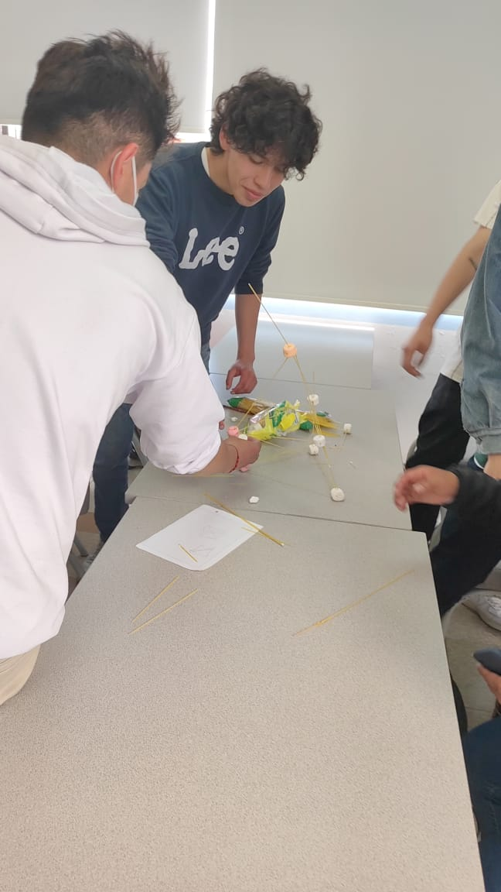

## CLASE 2 : **TALLER 01**
___

**FECHA** : 11 DE NOVIEMBRE DEL 2022
___

### OBJETIVO 
___
* Contruir una torre de spaguetti y malvaviscos.

* Usar la menor cantidad de materiales posibles. 
* Usar una sola mano ya que la otra estara agarrada con la de su compañero. 
___

### METODOLOGÍA 
___
 >Se elaboraron grupos de trabajo en los que deberan trabajar juntos para poder lograr el objetivo principal en donde cada uno usara una técnica diferente en cada caso.
 ___
 ### RESULTADOS 
 ____
| TABLA DE RESULTADOS   | |
|------------|------------|
| GRUPOS     | LONGITUD   |
| Toscanitos | 42 cm      |
| Vittirios  | 57 cm      | 
| Pibes      | 53 cm      | 
| Dinamita   | 52 cm      |
| BETA       | 75 cm      |
____

### IMAGEN 

