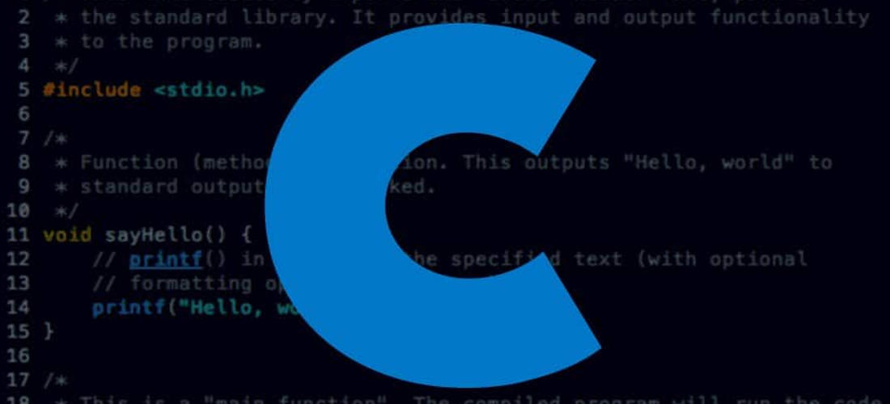

## CLASE 4 : **INTRODUCCIÓN A LA PROGRAMACIÓN**
___
**FECHA** : 14 DE NOVIEMBRE DEL 2022
____

## *EL LENGUAJE A UTILIZAR ES*: 
___
* Para Programación Estructurada:

* Programación orientada a Ejemplos:

___
#### SE TRABAJARA EN VS CODE:
___

___

Algunas de sus extensiones son:
* c/c++
* Ejecución de compilación c/c++
* Paquete de extensión c/c++
* Generador de proyectos c/c++
* Temas c/c++
* C#
* c++ sentido inteligente
* Integración Draw.io
* Integración de Draw.io - Construcción de Insiders
* Vista previa de Drawio
* Herramientas de archivo MAKE
* PDF de descuento
* rebajas
___

Sus shorcuts más utilizados son :

1. Paleta de comandos

**windows** : CTRL + MAYÚS + P

2. Apertura Rápida

**Windows** : CTRL + P

3. Alternar barra lateral

**Windows** : CTRL + B

4. Cursor multiselección

**Windows** : CTRL + D

5. Copiar línea

Windows : MAYÚS + ALT + ARRIBA o MAYÚS + ALT + ABAJO

6. Bloque de código de comentario

Windows : MAYÚS + ALT + A (comentario de varias líneas), CTRL + K + C (comentario de una sola línea)

7. Retroceder/avanzar

**Windows** : ALT + --> O +->

8. Mostrar todos los símbolos

**Windows** : CTRL + T

9. Sugerencia de activación y sugerencias de parámetros de activación

**Windows** : CTRL + ESPACIO, CTRL + MAYÚS + ESPACIO
