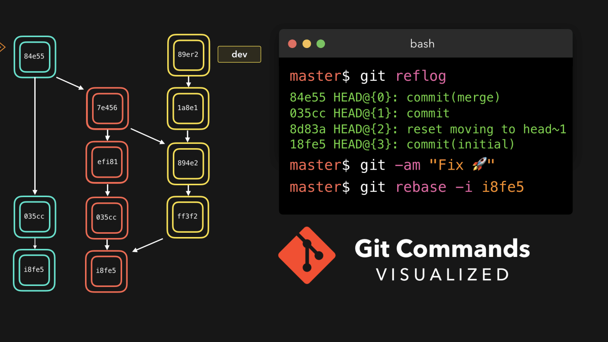

## CLASE 4: **INTRODUCCIÓN A GIT**
____
**FECHA** : 15 DE NOVIEMBRE DEL 2022
____

### ¿QUÉ ES EL GIT?
___
>Git fue creado en 2005 por Linus Torvalds (el creador de Linux).Esto fue de gran ayuda en el ambito del software. Desde ese momento se dieron a conocer plataformas que con el pasar del tiempo se hicieron conocidas , como GitHub o GitLab, en donde estas tienen libre acceso al uso online. (Imagen Git)

___
### COMANDOS DE GIT
* Tu identidad 
~~~ 
$ git config--nombre de usuario global "Emma Paris"

$ git config--correo electrónico de usuario globaljohndoe@example.com
~~~
___
* Verificando 
~~~ 
$ git configuser.nombre

$ git configuser.email
~~~
___
* Inicio de control de versiones 
~~~ 
$ git init

$ git status

$ git add.

$ git add
~~~
____
* Nombre/Carpeta/Nombre del Archivo 
~~~ 
$ git commit -m 'mensaje : versión inicial del proyecto'
~~~
___
* Quitar archivos de control 
~~~ 
-clonando$ git clone https://github.com/xxyyy/abc $ git clone https://github.com/xxyyy/abc mi PropioNombre
~~~
___
* Archivos Ignorados
~~~ 
$ echo 'token.mat' >> .gitignore
~~~
___
* Agregar archivo forzado
~~~ 
$ git add - f Nombre Archivo.log
~~~
____
