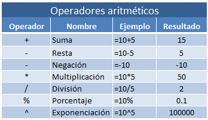
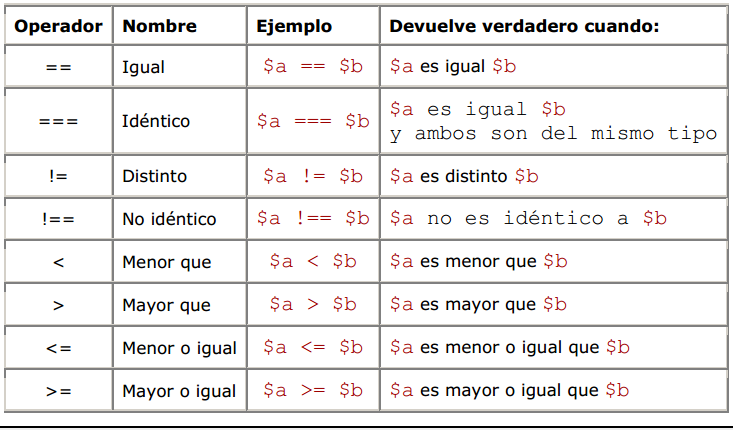

## CLASE 7 : **OPERADORES**
___
**FECHA** : 21 DE NOVIEMBRE DEL 2022
____
### OPERADORES BÁSICOS
 
 
 ___
 ### EJEMPLO
```c
#include <stdio.h>
//@author: David Duque 
int main()
{
    int num1,num2,resultado,a=3,b=8; //Declarar variables

    printf("ingrese el primer valor\n");
    scanf("%i",&num1);
    printf("ingrese el segundo valor\n");
    scanf("%i",&num2);
    resultado = a*(num1 + num2);
    printf("el resultado de la suma es:%i\n",resultado);
    return (0);

```
___
### EJEMPLO 2
```C
int a, b;
    printf("Introduce dos enteros separados por un espacio: \n");
    scanf("%i %i", &a, &b);

    if (a > b)
        printf("El mayor es %i", a);
    
    if (b > a)
            printf("El mayor es %i", b);
    if (b == a)
            printf("son iguales");

    // if (a>b)
    //     printf("El mayor es %i", a);
    // else
    //     if (b > a)
    //         printf("El mayor es %i", b);
    //     else
    //         printf("son iguales");
    printf("\n");
}
```


